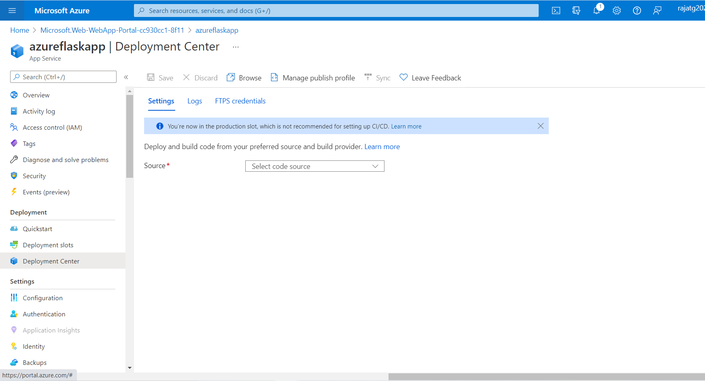
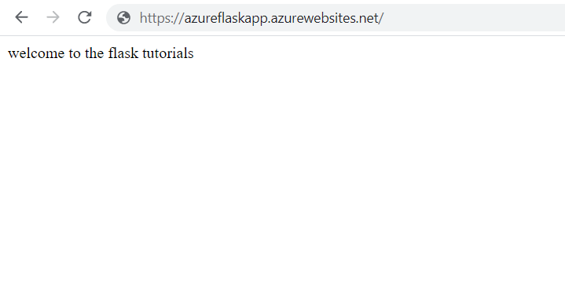
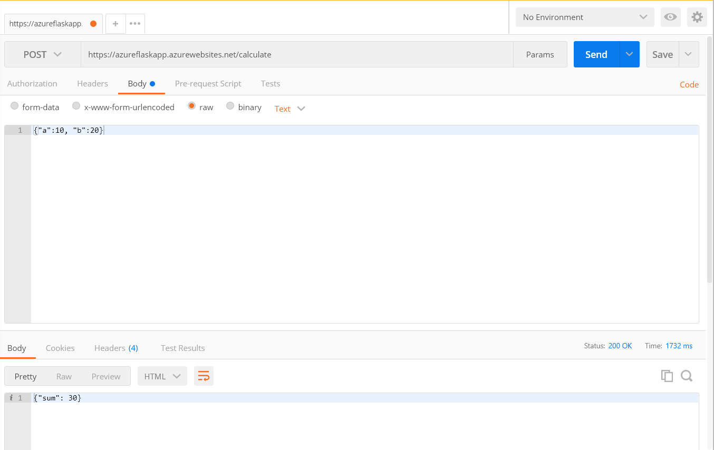

# Flask App on Azure

1. Login to [Azure Portal!](https://portal.azure.com/) 
2. Create a Resource if not already created 
    1.  Click on Create a resource tab
    2.  Click on Web App
3. Create Web app
    1.  Choose your subscripion
    2.  Create a new Resource Group
    3.  Create a unique name for webapp. I have created azureflaskapp as 
    4.  I need to choose whether I want to publish the app directly from the code or Docker Container. I will choose Code in this demo.
    5.  Choose the runtime stack i.e Its Python, Java or whetever. I have choosen Python3.8.
    6.  OS is Linux
    7.  region - Default is Central U.S and I will not change it for now.
    8.  **You should change Sku and Size if you don't want to be charged**. I will pick F1, which is free, under Development and Test.
    9.  Click on Review  and Create and then Create. A new deployment will be created.
4.  Open the newly created webapp
    1.  Click on Deployment Center as in the image
          
    2.  Choose the source as **GitHub**
        1.  Organisation - rajatg11
        2.  Repository  - Azure_Python_Flask_app
        3.  Branch - main
        4.  Save it
    3.  Go to Overview and copy the URL
5.  There are two end points in Flask app
    1.  First End point does not need any inputs and it prints "welcome to the flask tutorials".
        1.  It can be directly accessed from the Browser
        2.  Type https://azureflaskapp.azurewebsites.net/  
        3.  Do not forget to put '/' in the URL
              
    3.  Second End Point needs two inputs and return the sum of these numbers. As we do not have UI to enter inputs so we can use Curl command or Postman. I have choose Postman.
              
